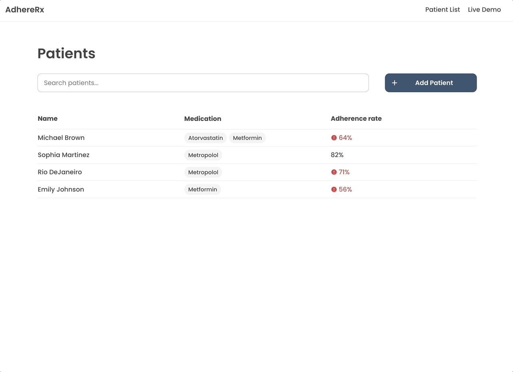
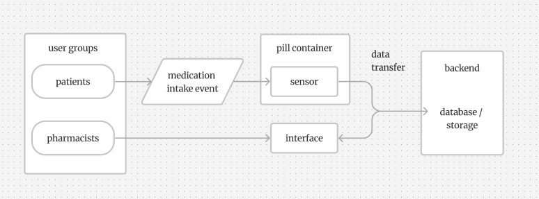
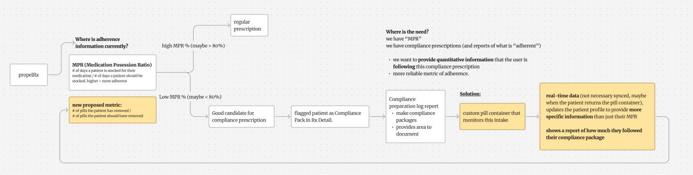

# AdhereRx

This is the project repository for an Engineering Capstone project developed over three terms in the following courses: BME 362 Biomedical Engineering Design Workshop 1, BME 461 Biomedical Engineering Design Workshop 2, BME 462 Biomedical Engineering Design Workshop 3 (Faculty of Engineering, University of Waterloo). Our team, **"AdhereRx,"** focused on addressing medication non-adherence by creating a tool for pharmacists designed to provide data-driven insights, enabling more personalized patient support. **https://adhere-rx.web.app/**

“A way to **address the need for quantitative medication intake data** to be used by **pharmacists** that allow them to **quickly identify non-adherent behaviours.**”

**Technologies Used**

- Design: `Figma`  
- Languages/Tools used: `React.js`, `JavaScript`, `CSS`, `Node.js`,`MySQL`,  
- Cloud Technologies: `Arduino IoT Cloud API`  
- Hardware Technologies: `Arduino MKR WiFi 1010`, `Photoresistors`,

## Project Background

Medication non-adherence occurs when patients do not take their medications as prescribed [1]. This can be caused by cost and access barriers, functional or cognitive limitations, or inadequate knowledge about disease management and the effects of medication [2]. Low rates of medication adherence act as a barrier to successful long-term treatment, resulting in a lower quality of life, increased mortality rate, and an increased burden on the healthcare system [1][3]. Existing solutions for medication non-adherence commonly target patients, using reminders or automated dispensers; or pharmacists, who intervene when patients report low adherence rates. However, both approaches have limitations.

**1. Patient-oriented solutions.** Current patient-oriented solutions place the technological burden on the patient themselves. For example, smart pill containers that send reminders to patients. However, these products do not address concerns such as the **patient’s functional or cognitive decline, barriers to accessing technology, or low health literacy.**

**2. Pharmacist-oriented solutions.** Current pharmacist-oriented solutions lack the information needed to appropraitely determine why a patient is non-adherent and how to resolve the issue. For example, qualitative data such as patient conversations, unreliable refill dates, or Medication Possession Ratio (MPR) as a measure of adherence. These solutions **do not provide any descriptive information on how and when they take their medication.**

## Our Solution

To address both user-needs we created a system with both a hardware and software product.

**1. Patient-facing hardware.** The hardware was designed with a familiar pill organizer form factor to minimize disruption to existing patient routines. The integrated technology enabled passive data collection with minimal maintenance or behavioral change required from the patient.

**2. Pharmacist-facing software.** Developed a web-based interface that allows pharmacists to remotely monitor patient medication adherence. The software visualizes intake patterns and missed doses using data collected from the patient-facing hardware, enabling pharmacists to make more informed, personalized recommendations during consultations. The system was designed to integrate into existing pharmacy workflows, prioritizing clarity, efficiency, and clinical relevance.

## Features

- **Hardware Component (Pill Container):** Detects medication intake events using photoresistors and a custom sensor array interfaced with an Arduino MKR WiFi 1010 board.
- **Software Component (User Interface):** A web application developed using React.js and Node.js for front-end and back-end, respectively, displaying summarized patient data stored in a MySQL database.

## Data Analysis & Adherence Metrics

This module includes helper functions that process raw patient medication intake data and calculate summary adherence statistics, enabling pharmacists to easily interpret patient behavior and identify patterns in medication adherence.

The key objectives of this data analysis are to:

- Categorize medication intake events (on time, early, late, missed)
- Generate percentage summaries of adherence behaviors
- Visualize trends in adherence by month and day of the week
- Prepare data for clear, actionable display in the pharmacist-facing dashboard

## How this fits into pharmacist workflow

Below is an example of how this technology could integrate into a pharmacist’s existing workflow. In this scenario, the pharmacist uses PropelRx, a pharmacy management system, to track patient medication adherence. Currently, adherence information is primarily based on the Medication Possession Ratio (MPR), which measures how consistently a patient refills their prescriptions. However, this system does not capture whether patients actually take their medications as prescribed.

Our proposed solution introduces a new adherence metric based on pill removal data, collected through a custom pill container. This data would be incorporated into the pharmacist’s workflow via compliance preparation reports in PropelRx, providing a more accurate, behavior-based measure of adherence. By integrating this information, pharmacists can gain clearer insight into patient behavior and offer more personalized, informed consultations.

## References

[1] Adherence to long term therapies. World Health Organization, 2003  
[2] B. Jimmy and J. Jose, “Patient medication adherence: Measures in daily practice,” Oman Medical Journal, vol. 26, no. 3, pp. 155–159, May 2011.  
[3] N. M. Rickles, G. J. Young, J. A. Hall, C. Noland, A. Kim, C. Peterson, M. Hong, and J. Hale, “Medication adherence communications in community pharmacies: A naturalistic investigation,” Patient Education and Counseling, vol. 99, no. 3, pp. 386–392, 2016.  
