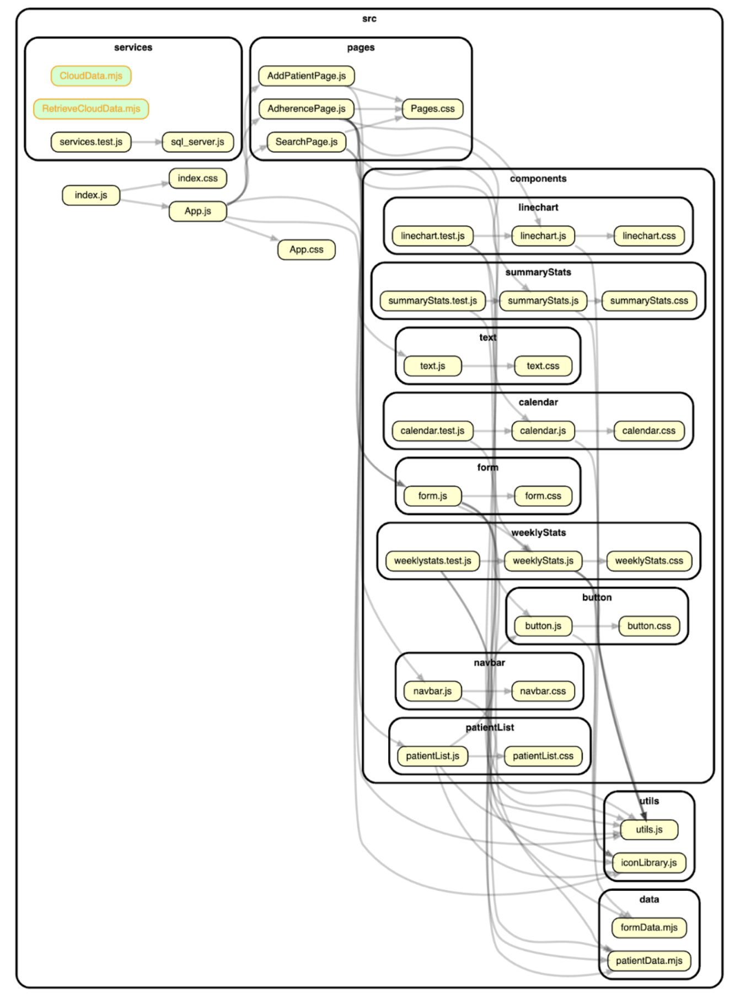

# AdhereRx

This was an engineering capstone project focused on addressing the issue of medication non-adherence by developing a tool aimed at pharmacists. This tool is designed to supply pharmacists with data that will guide them in offering tailored assistance to patients.

## Features

- Hardware Component: Detects medication intake events using photoresistors and a custom sensor array interfaced with an Arduino MKR WiFi 1010 board.
- Software Component: A web application developed using React.js and Node.js for front-end and back-end, respectively, displaying summarized patient data stored in a MySQL database.

## Tech Stack

- UI Wireframing: Figma
- Frontend: React, JavaScript, CSS
- Backend: Node.js
- Database: MySQL
- Hardware: Arduino MKR WiFi 1010, photoresistors, custom sensor design
- API: Arduino IoT Cloud API

## Key Components

### Hardware

- Pill Organizer: Integrates sensing technology to detect medication removal events.
- Sensing Mechanism: Utilizes photoresistors configured with Arduino to track light changes indicating pill removal.

### Software

- Pharmacist Dashboard: Displays patient adherence data, including time and frequency of medication intake.
- Data Analysis: Advanced SQL queries analyze intake patterns; the interface provides visual summaries and detailed adherence reports.

## System Architecture Diagram

